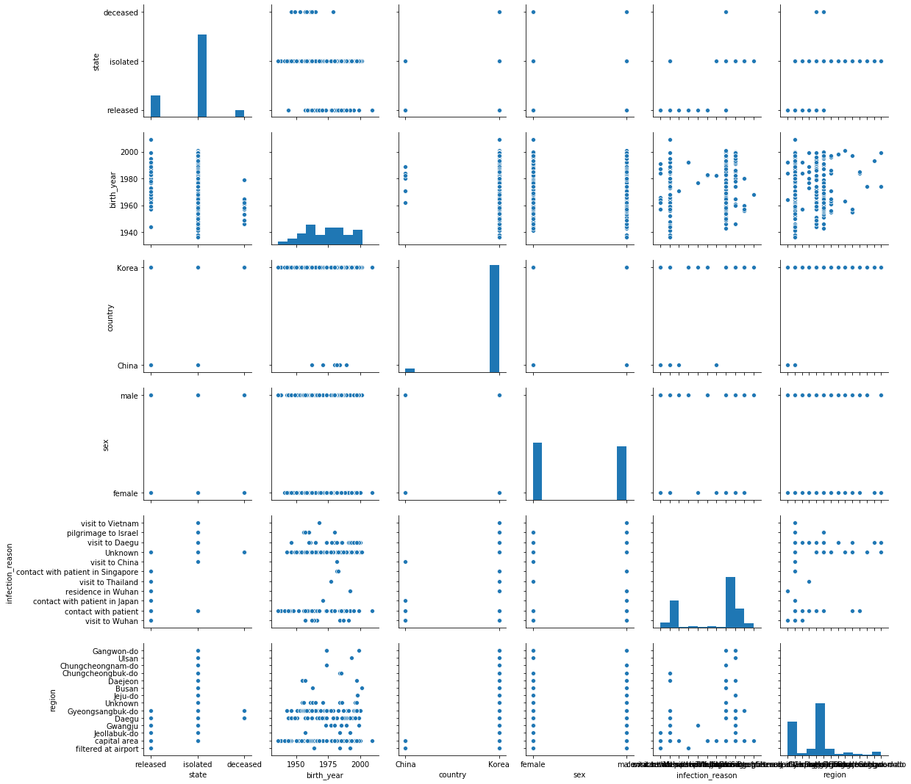

# Data-Science-for-COVID-19-in-South-Korea

The csv file in the data folder named covid.csv contains information about people with COVID-19 in South Korea.
Becomes.
* This file is displayed by the reader in a table.
* Explain the data by looking at the rows and columns of the description. Shows the number of data and column names.
* Obtain and display max, mean and std values ​​in the birth_year column.
* Check if there is a null value in the data or not. If any, use the appropriate method to remove it from
Destroy.
* In this section you do data visualization. Display the scatter plot, matrix diagram, and histogram by selecting the appropriate column of data.
* Check if this set is outlier or not. If so, state your reason
And offers a way to solve it.

# Part II (Linear Regression):
For this section, there is a data set of a number of students in the data folder named student.csv. The purpose of
This section predicts the student's final grade (G3 attribute) using linear regression. Information
You can see related to this data set in this link.
The data should be divided into two parts: train and test) The division ratio is 80 to 20 and you can use the methods
Ready to use (and do linear regression on train data. For simplicity, just the column
Use columns that have numeric values) In general, you can use columns that are related and the value
Converted have no numbers to numbers (.
Then predict the final score (G3) for test data and accuracy (trained model)
Get.
